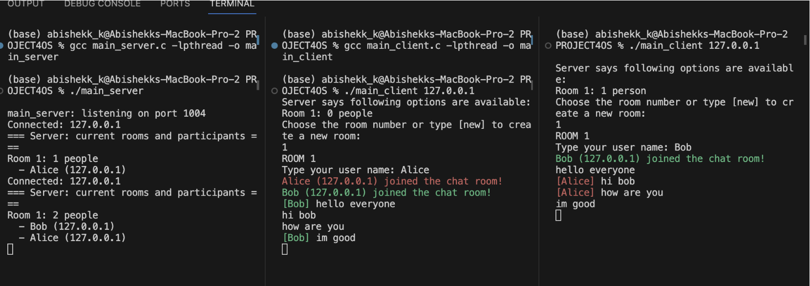
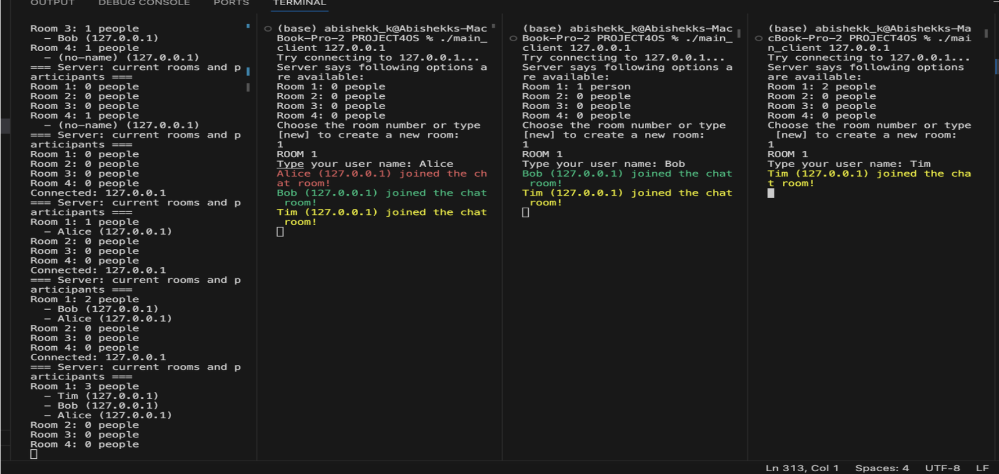
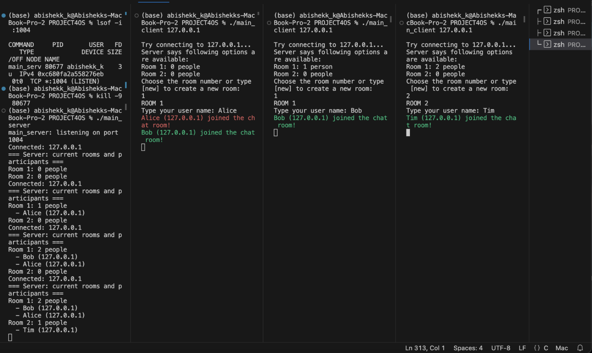
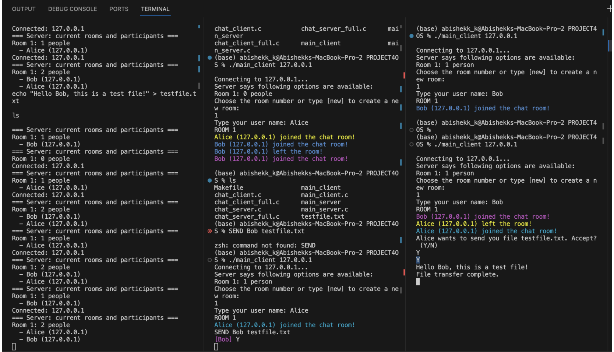

# Multithreaded TCP Chat Server

A multithreaded client-server chat application written in C using POSIX sockets, TCP/IP networking, and pthreads. The server supports multiple concurrent users, dynamic chat rooms, colored usernames, real time messaging, and peer to peer file transfers while ensuring thread safe communication through mutex synchronization.

---

## Features

- Multi-threaded server capable of handling many clients simultaneously
- Dynamic chat room creation and room selection
- Real-time messaging within chat rooms
- Username registration for each client
- Color-coded usernames for improved readability
- Peer-to-peer file transfer between users in the same room
- Thread-safe shared data structures using POSIX mutexes
- Automatic join/leave notifications
- Server-side room and participant tracking
- TCP socket communication over IPv4

---

## Technologies Used

- C
- POSIX Threads (pthreads)
- TCP/IP Socket Programming
- Linux
- GCC
- POSIX Networking APIs

---

## Project Architecture

```
                        +----------------------+
                        |      Server          |
                        |  (main_server.c)     |
                        +----------+-----------+
                                   |
              -----------------------------------------
              |                 |                     |
        Client Thread      Client Thread       Client Thread
              |                 |                     |
           Client A          Client B            Client C
               \                |                /
                \               |               /
                 +-----------------------------+
                 |        Chat Room #1         |
                 +-----------------------------+
```

Each connected client is assigned its own thread, allowing multiple users to communicate simultaneously without blocking one another.

---

## Project Structure

```
multithreaded-chat-server/
│
├── README.md
├── LICENSE
├── Makefile
│
├── src
│   ├── main_server.c
│   └── main_client.c
│
├── screenshots
│   ├── server.png
│   ├── chat.png
│   └── file-transfer.png
│
└── docs
```

---

##Testing 
- 
● This output shows that the server starts on port 1004 and waits for incoming connections
● Then when a client connects, the server prints the current room list
● Then the client is prompted to choose a room or create a new one if no room exist, then they type in their username
● After joining, the server updates the room and displays the current list of participants.
● Clients also see message from one another inside the same room
- 
  ● This output shows that multiple clients run in separate terminals and connects to the same server
● The server updates the room list dynamically as new clients join as this shows users in each room
● Then the clients joining different rooms don’t see each other’s chat confirming room isolation
● And when the client joins, the server prints an updates room/ participant table
● Supports independent room management 
- 
● This output shows when the client runs without specifying a room or using “new”, the server
sends a list of all available rooms
● Then the client must choose a room number or type in “new” for UI completeness
● If the user chooses an existing room, the server puts them into that room and notifies all users
● If the room is empty or doesn’t exist, then the server handles creation or error messages as needed
● There are also multiple side to side clients displaying accurate room roster and join notifications
- 
● This output shows that the client supports a special message format where you can send and
receive files.
● The server notifies the receiving user and asks to either accept or reject it
● And if accepted, the file is streamed in binary safe mode and saved in the receiver’s directory
● The transfer finishes with “file transfer complete” and the receiver also sees the full file contents.


## How It Works

### Server

The server:

- Listens for incoming TCP connections on port **1004**
- Creates a dedicated thread for every connected client
- Maintains multiple chat rooms
- Broadcasts messages only within the sender's room
- Handles room creation and room joining
- Synchronizes shared resources using mutexes
- Coordinates peer-to-peer file transfers

---

### Client

The client:

- Connects to the server
- Allows users to join or create chat rooms
- Registers a username
- Sends chat messages
- Receives messages asynchronously using a separate receiver thread
- Supports sending files to another user

---

### Workflow

```
Sender
   │
   │ SEND username filename
   ▼
Server
   │
   │ Notify recipient
   ▼
Recipient
   │
Accept? (Y/N)
   │
   ▼
Transfer begins
```

If the recipient accepts, the server streams the file over the existing TCP connection.

---

## Skills Demonstrated

- Concurrent Programming
- Multithreading
- POSIX Threads
- Socket Programming
- TCP/IP Networking
- Linux Systems Programming
- Client-Server Architecture
- Synchronization with Mutexes
- Dynamic Memory Management
- File I/O
- Data Structures (Linked Lists)

---

---

## Author

**Abishekk Kailashram Krishna**

Linkedin: https://www.linkedin.com/in/abishekk-krishna/

---
